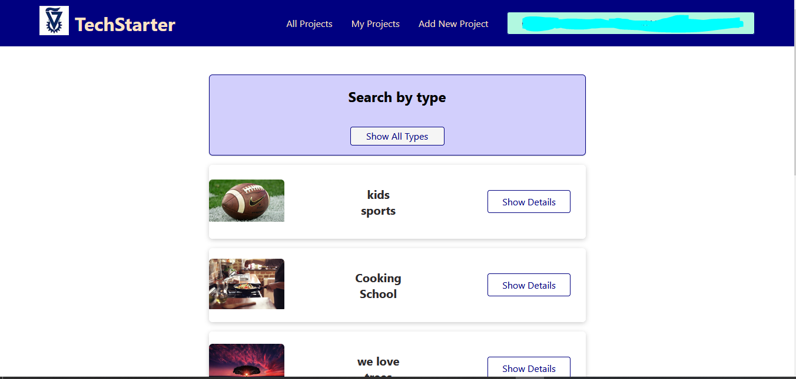

# Solidity And next.js Crowdfunding

## Intro
 
In this project we'll implement a crowdfunding web app based on Ethereum blockchain.
 
The backend will be written in solidity and the frontend with React.ts.
 
 

### Features:
- login with crypto wallet (Metamask for example).
- users will be able to open new projects.
- users will be able to edit their own projects.
- users will be able to search other projects.
- users will be able to fund other projects.
- project owner must set date limit and target amount.
- if project's time limit has reached without the target amount the project will be failed and all the funders can demand refund.
- if the project got enough funds before the time limit, the project succeed and the owner can withdraw the funds.
- each project can have multiple project type, and users can filter and look for projects by project type.
- project owner need to set fixed amounts that the users can donate to the project.
- each project will have a funding history: name -> amount.
- users will be able to donate anonymously.
- project will get closed after successful withdraw or failure and refund.

### Gas Fees Information:
- owner successful withdraw - owner will pay the gas fees.
- demand refund - the user who demand refund will pay the gas fees.
- fund project - the user who fund the project. 
- create new project / edit existing project - project's owner
- deploy main app - main app's owner.
---

## Backend
As mentioned above, the backend is written in solidity and will be deployed to Ethereum testnet.
 
In this section we have two solidity contracts And 3 interface:
- Crowdfunding.sol
- Project.sol
- CrowdfundingInterface.sol - interface
- CrowdfundingWithTypes.sol - interface
- ProjectInterface.sol - interface
 

### Crowdfunding.sol
This contract represents the main app.
 
Our frontend will connect with this contract in order to:
- create new projects.
- get projects by project type.
- get projects by owner.
- get single project by address.
- get all projects.

### Project.sol
This contract represents a single project.
 
Our frontend will connect with this contract in order to:
- fund this project.
- check if project has fail.
- check if project has succeed.
- demand refund.
- owner withdraw.
- add/ remove project type.
- add/ remove fixed amount.
- change project image/name/description.
- get the current balance.
- get project's types.
- get funding history - two lists of funders and amounts.

### CrowdfundingInterface.sol
This interface is the most basic version of the main app.

### CrowdfundingWithTypes.sol
This interface will able the projects contracts to add types in the main contract. as well as add/remove connection between type to project's address.
 
Inherit from CrowdfundingInterface.
 
Since cyclic dependencies are forbidden, each project will have address of type  CrowdfundingWithTypes, and it will able the project to edit the main app's types pool.

### ProjectInterface.sol
This interface represent a single project.

 

## Backend Tests
The backend tests are written in python with brownie package.
 

### Test Setup and run
In order to run the test:
- open a brownie project with brownie init 
- locate the contracts/interface/tests in the proper directories
- in your cli enter into the backend dir inside the project. `cd .../<your_cloned_project>/backend`
- in your cli enter `brownie test`

 

### Test Cases
- deploy a new main app without projects.
- deploy new project from the main app and verify the info.
- project was succeed and owner can withdraw and only owner can withdraw.
- project was fail, every user can demand refund for funders, can't fund project if it fails.
- project failure with single user refund. user demand refund for himself and for another user. 
- get funding history, users can fund anonymously.
- owner and only owner can change project's types and the change reflects in the main app mapping.
- owner and only owner can change project's info: name/ description/ amounts to donate/ time limit.
- get all projects from main app, get projects by type, get projects by user.

 

## Backend Deployment

In this project we'll deploy our contracts to Rinkeby testnet.
 

### Prerequisite:
- Metamask account (or another wallet with Ethereum).
- Infura account (send RPC requests to the blockchain).
- brownie installed.

### How to deploy:
- Create .env file in your project.
- Create two env vars in your .env - PRIVATE_KEY, WEB3_INFURA_PROJECT_ID.
- Export your private key and assign to PRIVATE_KEY.
- Assign your Infura project id to WEB3_INFURA_PROJECT_ID.
- In your cli enter into the backend dir inside the project. `cd .../<your_cloned_project>/backend`
- In your cli Run the deployment script with `brownie run scripts/deploy.py --network=rinkeby`
- Now you can find your deployment info in `.../<your_cloned_project>/backend/build` dir.

### Deployment info:
In our github repo **inside build dir** you can find the Rinkeby deployment info:
- contracts/interfaces - all contracts/interfaces info such as ABI.
- deployments - deployment info, inside map.json you can find the contract's address.

---

## Frontend

The frontend in this project was written in Next.   
Connection with solidity contracts is done by usedapp provider (https://usedapp.io/). 
Image storing is done with nft.storage (https://nft.storage/docs/).  

you can see below the following sections:
- how to run this app locally
- pages (see Next.js docs on pages)
- API endpoint 
- components 
- contracts ABI (see solidity docs on ABI)
- consts.tsx

### How To Run This App
- clone this project
- in your cli go to the cloned project `cd .../<cloned_project>/frontend/crowdfunding`
- in your cli run `yarn install`
- add `.env` file with the following vars (locate this env var under `.../<cloned_project>/frontend/crowdfunding`):
    - `NFT_STORAGE_KEY` your nft.storage account.
    - `INFURA_URL` your infura url.
- in your cli run `yarn dev`
- in your browser go to `localhost:3000`
- if you deployed another version of solidity backend and you want to change the main contract address, in your cloned project change the var `MAIN_CONTRACT_ADDRESS` under `.../<cloned_project>/frontend/crowdfunding/consts.tsx`

### pages
please see next.js docs about pages.
- [projectId]
    - **usage**: display single project info.
    - **components**: this page render `ProjectInfo` component.
    - **getServerSideProps**: load project's info from the blockchain before rendering.
- api - see API endpoint section.
- confirm_close
    - **usage**: display confirmation page when user want to withdraw/demand refund upon success/fail.
    - **components**: this page render `ConfirmClose` component.
- confirm_field_change
    - **usage**: display confirmation page when user want to edit/add/remove field value.
    - **components**: this page render `ConfirmFieldChange` component.
- confirm_fund
    - **usage**: display confirmation page when user want to donate fund to a project.
    - **components**: this page render `ConfirmFund` component.
- confirm_project
    - **usage**: display confirmation page when user want to open a new project after using create project form.
    - **components**: this page render `ConfirmProject` component.
- new_project
    - **usage**: new project form.
    - **components**: this page render `NewProjectForm` component.
    - **on submit**: rout to confirm_project page with the relevant data.
- type_page
    - **usage**: display all projects with a specific type.
    - **components**: this page render `ProjectsList` component.
    - **getServerSideProps**: load projects by specific type from the blockchain before rendering.
- user_page
    - **usage**: display all current user projects.
    - **components**: this page render `ProjectsList` component, pass `isOwner=true` to enable editing.
    - **getServerSideProps**: load projects by user address from the blockchain before rendering.
- _app
    - please read next.js docs
    - add `DAppProvider` for web3 capabilities.
    - add `Layout` component to all pages.
- index
    - **usage**: main page, display all projects.
    - **components**: this page render `ProjectsList` component and `SearchBar` component.
    - **getStaticProps**: load all projects with relevant info.

### API Endpoint
please read next.js docs about api endpoints
- upload_images_storage 
    - **location**: `pages/api/upload_images_storage.tsx`.
    - **usage**: upload local image to nft.storage (please read the docs https://nft.storage/docs/).
    - **input**: image as File.
    - **output**: stored image ipfs url.

### Components
- edit_contracts - mostly confirmation components that sends changes to the blockchain with the help of usedapp provider (see the docs - https://usedapp.io/)
    - ConfirmClose - confirm withdraw/ demand refund operations.
    - ConfirmFieldChange - send project's owner changes (name/image/etc..)
    - ConfirmFund - verify donation request and transaction.
    - ConfirmProject - verify new project info and send request to the main contract.
- layout - all pages layout
    - ConnectButton - present the current account/ activate connection handler.
    - Layout - render the main layout - NavBar + children.
    - NavBar - useful links - all projects/user's projects/new project.
- ui - general ui components and css
    - Card - display project info in projects list
    - SearchBar - for the main page, able the user to get all projects by specific type.
- projects - project related components
    - DonorsList - display donation history for a single project.
    - EditableInfo - display all editable fields in a project preview (name/image/end date/etc...). has handlers for fields changes and submit button.
    - FinancialInfo - display project's balance and status as well as donation functionality. has handlers for donation actions.
    - ProjectElement - this component represents a single project in **projects list** inside the main page/user page/ type page. has button thar routs to project's page.
    - ProjectInfo - single project preview. renders DonorsList, EditableInfo, FinancialInfo.
    - ProjectsList - projects list of all props given projects.

### Contracts ABI
- please read solidity docs about ABI.
- this section is used by web3 provider to activate contract's methods.
- contracts ABIs:
    - crowdfunding_abi.json - main app's ABI.
    - project_abi.json - single project ABI.

### consts.tsx
- global constants file.
- currently holds only the main solidity contract's address (rinkeby testnet).